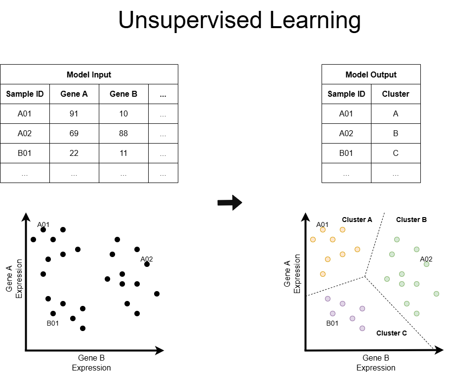
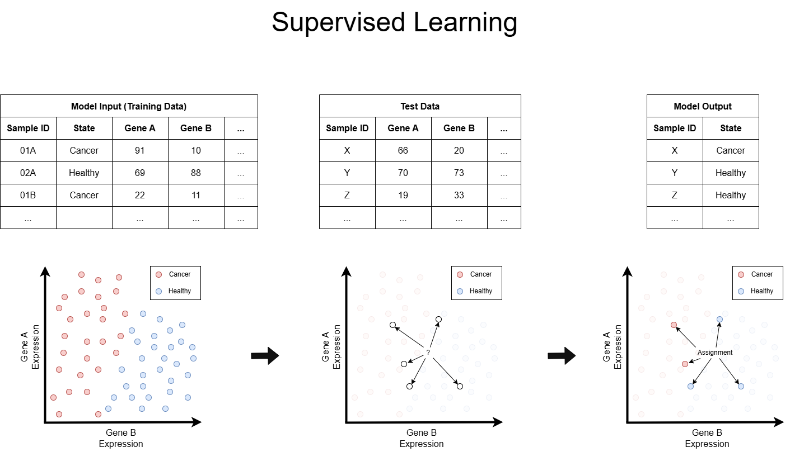

This is a brief overview of the fundamentals of machine learning (ML), also known as AI. For a deeper dive, jump into our courses, training, and resources at the bottom of the page.

## 1. What is AI / Machine Learning

**AI (Artificial Intelligence)** is the broad idea of getting computers to do things that normally need human-like intelligence, such as understanding language, recognizing images, making decisions, playing games, and so on. It is a broad field that has garnered a lot of attention lately, thanks to advances in **Machine Learning (ML)**, which is one of the main ways we build AI today.

Machine learning refers to *how* models are built. Older approaches took a top-down route, where every rule or decision a model made had to be explicitly programmed by hand (these are often called **expert systems**). Machine learning instead takes a bottom-up approach: the "machine" **learns** the rules itself from the data it's given, rather than being told them explicitly. Thanks to advances in computational power since the 2000s, it has become possible to train ever larger and more complex models.

Expert systems have seen relatively little progress in recent years, so in everyday use "ML" and "AI" are often treated as interchangeable — though "AI" tends to get used more often, since it sounds more striking.

Although machine learning is a subfield of AI, but it is itself a wide umbrella, containing subfields such as classical ML, deep learning, and generative AI. Well-known tools like ChatGPT, AlphaFold, and random forest models all fall somewhere under this ML/AI umbrella.

**In summary:**

-   **AI** = the goal (machines behaving intelligently)

<!-- -->

-   **ML** = a method for reaching that goal (learning from data/examples rather than being explicitly programmed)

## 2. What can I do with AI/ML?

This is a huge field, but at a high level, there are two broad ways to work with AI/ML:

1.  **Use existing tools**: Apply pre-trained models to your data, much like using existing bioinformatics tools.

2.  **Create your own models**: Build new ML models for a specific task or analysis, much like developing your own bioinformatics tool.

### 2.1. Use existing tools (pre-trained models)

There are many ready-to-use tools available, covering a wide range of tasks.

**Large Language Models (LLMs)** are the most popular of these. They're powerful, but caution is advised if you use them for anything beyond formatting or summarizing text (see [What about LLMs?](#what-about-llms) below for why).

-   Online tools such as ChatGPT
-   LLMs hosted by the [ELM Platform](https://elm.edina.ac.uk/saml2/authenticate/elm)
-   Locally-hosted LLMs, e.g. via [Unsloth](https://github.com/unslothai/unsloth) or [LM Studio](https://lmstudio.ai/)

**Biology-focused tools** are also widely available:

-   [AlphaFold](https://alphafold.ebi.ac.uk/) is probably the most prominent example, used for protein structure prediction.
-   Many other tools exist for tasks across genomics, imaging, etc. Some are accessible online, others run locally.

### 2.2. Create your own models

Building your own model can range from fairly simple to highly complex, depending on how much data you have and how complicated the task is. In biology, the methodology generally falls into one of two categories, depending on the type of data available.

A helpful way to think about your data: imagine a large spreadsheet, where each **row** is a sample and each **column** is a feature (e.g. a gene, a SNP, a protein sequence, and so on).

If your data is **unlabeled** (i.e. you have not assigned your samples to categories, outcomes or any other measure) and you want to group similar samples together (a bit like constructing a naive phylogeny from scratch), you'll use **unsupervised learning**.

**Examples of unlabeled data:**

-   Single-cell RNA-seq counts across thousands of genes, with no prior information about which cell type each cell belongs to.

-   SNP genotype data across a population, where you don't yet know how individuals group into subpopulations.

-   Microbiome community profiles from different samples, with no predefined groupings of "similar" samples.

If your data is **labelled** (i.e. a category or outcome is already assigned to each sample) and you want to build a model that accurately predicts that category for new samples, you'll use **supervised learning**.

**Examples of labelled data:**

-   Images of cells labelled as cancerous or non-cancerous

-   Transcriptomic profiles labelled by cell type or disease status

#### **2.2.1 Unsupervised models**

*Definition:* Unsupervised learning finds structure or patterns in data that has no predefined labels. One example is grouping samples into clusters based on similarity across features, without knowing in advance what those groups represent.

**Common approaches:**

-   **Clustering algorithms** group similar samples together. Popular methods include *k-means* (partitions data into a fixed number of clusters), *hierarchical clustering* (builds a tree of nested clusters, similar in spirit to a phylogenetic tree), and *DBSCAN* (finds clusters of varying shape and density, and can flag outliers).

-   **Dimensionality reduction** techniques compress high-dimensional data (e.g. thousands of genes) down to a handful of components that capture most of the variation, making the data easier to visualise and interpret. Common methods include *PCA* (Principal Component Analysis), *t-SNE*, and *UMAP*.

**Use cases:**

-   Identifying novel cell types or states from single-cell RNA-seq data.

-   Uncovering population structure from SNP/genotype data.

-   Grouping samples by expression or methylation profile to reveal disease subtypes.

-   Visualising high-dimensional omics data in two or three dimensions for exploratory analysis

#### **2.2.2 Supervised models**

*Definition:* Supervised learning trains a model on labelled examples so that it learns to predict the correct label (or value) for new, unseen data.

**Common approaches:**

-   **Classification** predicts a category (e.g. "cancerous" vs "non-cancerous", or one of several cell types).

-   **Regression** predicts a continuous value (e.g. predicted gene expression level, or a patient's age from methylation data).

**Use cases:**

-   Diagnosing disease from medical images (e.g. classifying histopathology slides as cancerous or benign).

-   Predicting protein function or structure-activity relationships from sequence data.

-   Predicting drug response or toxicity from molecular features.

-   Classifying cell type from single-cell gene expression profiles, once reference labels are .

### 2.3. What about Deep Learning (DeepL)? {#what-about-deep-learning-deepl}

Deep learning is a subfield of machine learning based on artificial neural networks with many layers ("deep" networks), which allow the model to learn increasingly complex and abstract representations of the data.

**Classical ML vs. deep learning:**

-   **Classical ML** methods (e.g. random forests, SVMs, logistic regression) generally rely on *manually engineered features*; a human decides, using domain knowledge, which measurements or summary statistics to feed into the model (e.g. GC content, expression of a specific gene panel). They tend to work well even with relatively small datasets and are often more interpretable.

-   **Deep learning** methods can learn useful features directly from raw data (e.g. raw pixel values in an image, or raw DNA/protein sequence), removing the need for manual feature engineering. This flexibility comes at a cost: deep learning models typically require much larger datasets and significantly more computational power to train well, and they are often harder to interpret ("black box" behaviour).

As a rule of thumb: if you have a modest, well-structured dataset and interpretability matters, classical ML is often the better starting point. If you have very large datasets (e.g. large imaging or sequence datasets) and the relationships in the data are complex, deep learning may offer an advantage.

Importantly, both unsupervised and supervised models can be built using either classical ML methods or deep learning. The unsupervised/supervised distinction is about *what kind of data and task you have*, while classical ML vs. deep learning is about *what kind of model you use to solve it*.

### 2.4. What about LLMs? {#what-about-llms}

Large Language Models (LLMs) are a subfield of **generative AI**, which is distinct from the **discriminative AI** methods described above (unsupervised and supervised learning, as typically applied to classification or clustering tasks).

-   **Discriminative models** learn to distinguish between categories or predict an outcome from input data (e.g. "is this cell cancerous or not?").

-   **Generative models**, by contrast, learn to produce new content (text, images, sequences, and so on) that resembles the data they were trained on.

    -   **LLMs** are a type of generative model trained on huge amounts of text, and are the technology behind tools like ChatGPT.

In a simplified sense, LLMs work by predicting the next word in a sequence in order to generate *plausible* (not necessarily *accurate*) text. Because of this distinction, LLM output should never be trusted as correct without verification, and LLMs frequently "hallucinate" (i.e. confidently produce false information, broken code, or fabricated citations).

LLMs are capable at text-based tasks (and more, when used in an agentic way), including writing code. However, they become increasingly unreliable on more complex tasks, struggle with large codebases, and should not be used as a replacement for deeper, critical thinking.

## 3. How can I get started?

That depends on what you want to learn! Below is a rough guide, ranked in order of increasing complexity:

1.  **Use ready-made tools in a browser**: Minimal coding or bioinformatics knowledge required.

2.  **Use tools on the command line**: Often chained together with other bioinformatics tools, so you'll need to be comfortable with the Linux command line (Bash).

3.  **Create your own models**: Requires understanding the theory behind machine learning, so you can build models that are reliable and avoid common pitfalls; plus you will need to know a programming language like Python to train/test them.

4.  **Deeper analysis and research**: Combining strong ML theory with domain expertise to push into novel methodology or applications.

### 3.1. Skills & Training

-   **Bash (Linux command line)**: Essential for performing basic operations on computers and running bioinformatics tools.

    -   [WCB introduction to Linux course](http://bifx-core3.bio.ed.ac.uk/hyweldd/training/Bioinformatics_on_the_Command_Line/)

-   **Python**: most major ML frameworks (scikit-learn, TensorFlow, PyTorch, etc.) are Python-based, so programming knowledge here goes a long way.

    -   COMING SOON

-   **Domain knowledge**: Every good ML project needs good data, and depending on your project you'll need the relevant biological/bioinformatics background to generate & interpret it correctly.

-   **ML theory and practice**: Algorithms, good modelling practices, how to avoid common pitfalls (overfitting, data leakage, etc.), plus how to actually implement and train models in code

    -   [An Introduction to ML with Python]() (Upcoming) - TO UPDATE

We're also happy to discuss long-term collaboration on projects. Please get in touch with Annita Chalka (achalka\@ed.ac.uk) or Shaun Webb (shaun.webb\@ed.ac.uk).

### 3.2. External Resources

-   **Bash**
    -   [The Unix Shell by Software Carpentry](https://swcarpentry.github.io/shell-novice/)
-   **Python**
    -   [Sci-kit Documentation](https://scikit-learn.org/stable/index.html): Popular classical ML framework.
    -   [Tensorflow Documentation](https://www.tensorflow.org/tutorials): Deep Learning ML framework.
-   **ML theory and practice**
    -   [StatQuest](https://www.youtube.com/playlist?list=PLblh5JKOoLUICTaGLRoHQDuF_7q2GfuJF): Videos going into detail about popular ML algorithms & techniques.

------------------------------------------------------------------------

*Have questions, or interested in collaborating? Contact us at achalka\@ed.ac.uk or shaun.webb\@ed.ac.uk.*
